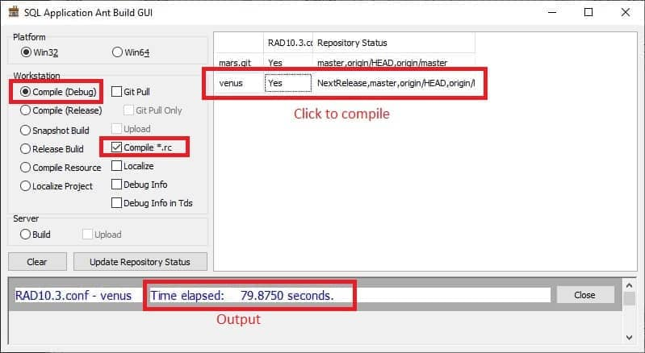
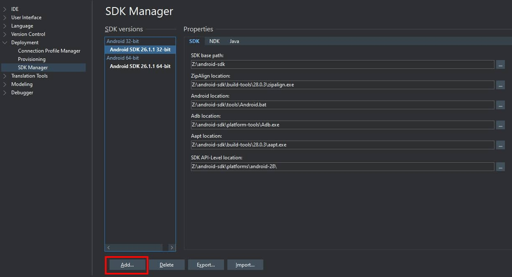
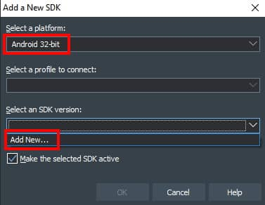
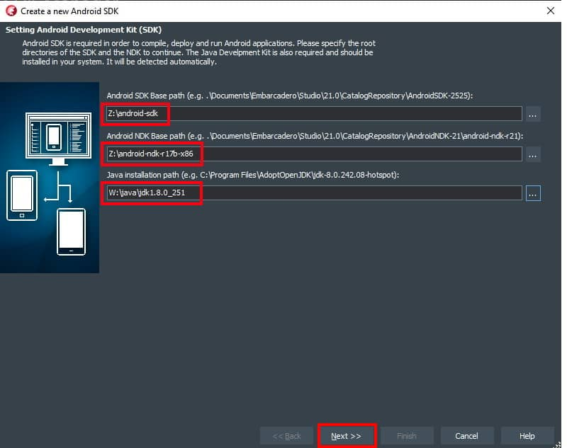
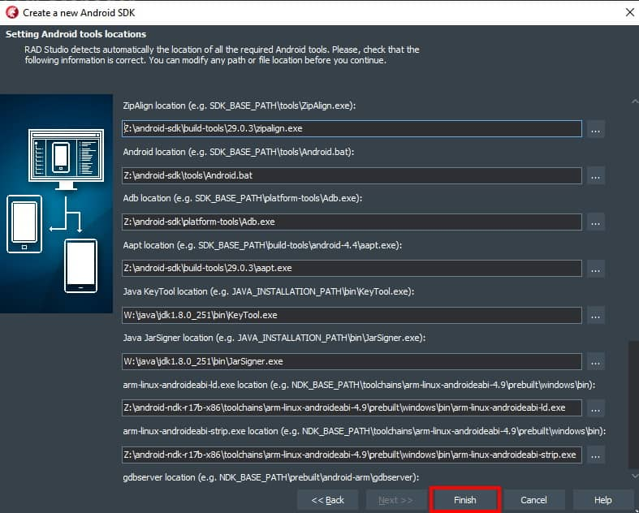

**Table of Contents**
- [1. Install RAD Studio and Setup Delphi Environment (First Time)](#1-install-rad-studio-and-setup-delphi-environment-first-time)
	- [1.1. Install Portable RAD Studio](#11-install-portable-rad-studio)
	- [1.2. Copy Component .bin and .src](#12-copy-component-bin-and-src)
	- [1.3. Setup Delphi Environment](#13-setup-delphi-environment)
	- [1.4. Setup ANT build](#14-setup-ant-build)
	- [1.5. Install MMX\_Setup](#15-install-mmx_setup)
	- [1.6. Install Additional Build Tools](#16-install-additional-build-tools)
	- [1.7. Install Git](#17-install-git)
	- [1.8. Generate SSH Private Key](#18-generate-ssh-private-key)
	- [1.9. Config ANT build](#19-config-ant-build)
	- [1.10. Build SQL Project](#110-build-sql-project)
- [2. Setup Android SDK and NDK](#2-setup-android-sdk-and-ndk)
- [3. RAD Studio 10-4-2 vhdx](#3-rad-studio-10-4-2-vhdx)
- [4. Delphi component using Git LFS](#4-delphi-component-using-git-lfs)
	- [4.1. Install Git LFS](#41-install-git-lfs)
	- [4.2. New Component](#42-new-component)
- [5. Update Apache ANT](#5-update-apache-ant)
- [6. RAD 11](#6-rad-11)

# 1. Install RAD Studio and Setup Delphi Environment (First Time)

## 1.1. Install Portable RAD Studio

1. Extract vhdx from `\\deer2\setup\engineer\radstudio.10.4.1.7.7z` and store it in a physical disk
2. Mount VHDX `radstudio-10.4.1.vhdx` (first time no need mount as Read-Only mode) with a drive letter, example **R:**
3. Go to **Edit the system environment variables** -> **Environment Variables...** -> **System variables** -> **Path,** add `R:\21.0\bin` and `R:\21.0\bin64` (`R:` is ur mounted letter)
4. Go to the drive (**R:**) and execute `setup.cmd`. If your computer name is `WINDOWS`, restart is not neccesary, else will  restart. 
5. Click **Start** and  launch `Delphi 10.4`, once to create default registry entries in `Computer\HKEY_CURRENT_USER\SOFTWARE\Embarcadero`
6. Exit Delphi
7. Unmount **VHDX**
8. Re-mount **VHDX** as **Read-Only** (recommended) using diskpart or diskmgmt.msc (**Action** -> **Attach VHD** -> select **VHDX** file and check **Read-Only**)
9. Copy `R:\Public\21.0\Styles` to `%Public%\Documents\Embarcadero\Studio\21.0`

## 1.2. Copy Component .bin and .src
1. Copy **latest** `rad10.4.component.bin.210128.7z` and `rad10.4.component.src.210128.7z` from `\\deer2\setup\engineer\`
2.  extract both to a physical disk
3.  mount with a drive letter, example `x:` **(rad10.4.component.bin.210128)** and `y:` **(rad10.4.component.src.210128)**
4.  Execute `x:\reg-update.cmd`

## 1.3. Setup Delphi Environment
1. Open **Delphi IDE**
2. Go to **Tools** -> **Options...**
3. Navigate to **IDE** -> **Environment Variables**
4. Under **User System Overrides**, **New** these environment variable if you don't have:

	| Variable              | Value           | Remark                                                                       |
	| --------------------- | --------------- | ---------------------------------------------------------------------------- |
	| Component             | `x:`            | Your component bin folder root, example **x:(rad10.4.component.bin.210128)** |
	| UnitOutputDir         | `w:\UnitOutput` | A folder to store compiled dcu files                                         |
	| OutputDir             | `w:\Output`     | A folder to store compiled binary files                                      |
	| Factory               | `w:\factory`    | A path of `\\deer2\setup\engineer\build\factory.7z`                          |
	| SourceDir             | `w:\Sources`    | A folder to store git clone repo                                             |
	| ActiveHostApplication |                 | leave it blank                                                               |
	| ActiveProjectModule   |                 | leave it blank                                                               |
	| OEM                   |                 | leave it blank                                                               |
	
## 1.4. Setup ANT build
1. Make sure you have install [JDK Java Development Kit](https://www.oracle.com/java/technologies/java-archive-javase10-downloads.html), **64 bit version 10 above** is preferred.
2. Run `java -version` in cmd to check java version.
	```cmd
	openjdk version "10" 2018-03-20
	OpenJDK Runtime Environment 18.3 (build 10+44)
	OpenJDK 64-Bit Server VM 18.3 (build 10+44, mixed mode)
	```
3.  Extract `\\deer2\setup\engineer\build\apache-ant-1.10.2-patch.7z` to your local application folder, example `w:\apache-ant-1.10.2.-patch`
4.  New environment variable in **Edit the system environment variables** -> **Environment Variables...** -> **System variables**
	
	| Variable Name | Variable Value               | Remark                  |
	| ------------- | ---------------------------- | ----------------------- |
	| ANT_HOME      | `w:\apache-ant-1.10.2-patch` | Your apache ant folder  |
	| JAVA_HOME     | `w:\java\jdk-10`             | Your installed JDK path |
 
5. Add new **path**
	- `%ANT_HOME%\bin`
	- `%JAVA_HOME%\bin`
6.	Run `ant -version` in cmd to check ant version, if you see the below message, your **ant** is ready to use 
	```cmd
	Apache Ant(TM) version 1.10.2 compiled on March 21 2018
	```

## 1.5. Install MMX_Setup
Install latest [MMX](https://www.mmx-delphi.de/downloads/)

## 1.6. Install Additional Build Tools
- `\\deer2\setup\engineer\build\dumpbin.11.0.50727.1.7z`
- `\\deer2\setup\engineer\build\innosetup-5.5.9-unicode.exe`
- `\\deer2\setup\microsoft.com\msbuild\BuildTools_Full.exe`, **must install**
- `\\deer2\setup\7-zip.org\7z1805-x64msi`
- `\\deer2\setup\engineer\build\factory.7z`, unzip to folder, eg: (`w:\factory`)
- `\\deer2\setup\engineer\build\SRNYSP~E.EXE` (s/n: LAENT628960210257716163)
- `\\deer2\public\xf\jh\dev-factory.7z`, for build snapshot, need to extract to **factory** folder

## 1.7. Install Git
Install [Git](https://git-scm.com/downloads)

## 1.8. Generate SSH Private Key
1. Run `ssh-keygen -b 4096` in cmd
2. Go to `C:\Users\<UserName>\.ssh`
3. Create a `config` file without extension
4. Add the following line to `config`:
	```txt
	Host git.sql.com.my
    	User git
			IdentityFile ~/.ssh/id_rsa
	```
5. Open `id_rsa.pub`, copy public key to git.sql.com.my
6. Run `ssh -T git@git.sql.com.my`, if you see the below message, your **Git** is ready to use 
	```cmd
	Welcome to GitLab, @<UserName>! 
	```
7. Recommend to remove all permission for `.ssh` folder. Right click `.ssh` folder **Properties** -> **Advanced** -> **Disable Inheritance** -> **Remove all inherited permissions from this object**
8. Then add back permission for your own user. Click **Add** -> **Select a Principal** -> Enter your user name in **Enter the object name to select** -> **Check Names** -> **OK** -> tick on **Full Control** -> **OK**

## 1.9. Config ANT build
1. Go to your SourcesDir `w:\sources`, cmd run `git clone git@git.sql.com.my:rtm/ant.git`
2. Create a file `RAD10.3.conf` in the clone **ant** folder, modify the content to suit your environment setting. You may ignore those name start with `_PRODUCT_`
	```txt
	_BUILD_RC=False
	_COMPONENT=x:\\
	_INNO_SETUP=C:\\Program Files (x86)\\Inno Setup 5\\iscc.exe
	_LOCAL_FACTORY=W:\\factory
	_LOCAL_PRODUCT=W:\\product
	_MSBUILD=C:\\Program Files (x86)\\MSBuild\\14.0\\Bin\\MSBuild.exe
	_OUTPUT=W:\\Output
	_PRODUCT_KEYFILE=C:\\Users\\jiahao\\.ssh\\id_rsa
	_PRODUCT_ROOT=/mnt/product
	_PRODUCT_SERVER=product.estream.com.my
	_PRODUCT_USER=product
	_PRODUCT_PORT=22
	_PROJECTS=mars.git,venus
	_PROJECT_PATH=project
	_RAD_STUDIO=R:\\21.0
	_SERVER_FACTORY=\\\\deer\\dev-factory
	_UNITOUTPUT=W:\\UnitOutput
	_LOCALIZE=True
	_SISULIZER=C:\\Program Files (x86)\\Sisulizer 4
	_GIT=c:\\Program Files\\SmartGit\\git\\bin\\git.exe
	_7ZIP=c:\\Program Files\\7-Zip\\7z.exe
	_DUMPBIN=W:\\dumpbin.11.0.50727.1\\dumpbin.exe
	_APP_DIR=c:\\Users\\jia hao\\Documents
	_TEMP=c:\\Users\\jiahao\\AppData\\Local\\Temp
	```

	| Variables       | Value                                                      | Remark                               |
	| --------------- | ---------------------------------------------------------- | ------------------------------------ |
	| \_BUILD_RC      | `False`                                                    |                                      |
	| \_COMPONENT     | `x:\\`                                                     | Your **component.bin** path          |
	| \_INNO_SETUP    | `c:\\Program Files (x86)\\Inno Setup 5\\iscc.exe`          | Your **Inno Setup 5** installed path |
	| \_LOCAL_FACTORY | `w:\\factory`                                              | Your **factory** extract path        |
	| \_MSBUILD       | `c:\\Program Files (x86)\\MSBuild\\14.0\\Bin\\MSBuild.exe` | Your **MSBuild** installed path      |
	| \_OUTPUT        | `w:\\Output`                                               | Your **Output** folder               |
	| \_PROJECTS      | `venus, mars`                                              | Project name                         |
	| \_PROJECTS_PATH | `project`                                                  |                                      |
	| \_RAD_STUDIO    | `r:\\21.0`                                                 | Your **RAD Studio** path             |
	| \_UNITOUTPUT    | `w:\\UnitOutput`                                           | Your **UnitOutput** folder           |
	| \_LOCALIZE      | `True`                                                     |                                      |
	| \_SISULIZER     | `C:\\Program Files (x86)\\Sisulizer 4`                     | Your **Sisulizer 4** installed path  |
	| \_GIT           | `c:\\Program Files\\SmartGit\\git\\bin\\git.exe`           | Your **Git** installed path          |
	| \_7ZIP          | `c:\\Program Files\\7-Zip\\7z.exe`                         | Your **7zip** installed path         |
	| \_DUMPBIN       | `W:\\dumpbin.11.0.50727.1\\dumpbin.exe`                    | Your **dumpbin** installed path      |
	| \_APP_DIR       | `c:\\Users\\jia hao\\Documents`                            |                                      |
	| \_TEMP          | `c:\\Users\\jiahao\\AppData\\Local\\Temp`                  | Your **temp** folder                 |

	> To Build Snapshot, the following value need to set:

	| Variables         | Value                             | Remark                       |
	| ----------------- | --------------------------------- | ---------------------------- |
	| \_LOCAL_PRODUCT   | `w:\\product`                     | Your **product** folder      |
	| \_PRODUCT_KEYFILE | `C:\\Users\\jiahao\\.ssh\\id_rsa` | Your **ssh public key** file |
	| \_PRODUCT_ROOT    | `/mnt/product`                    |                              |
	| \_PRODUCT_SERVER  | `product.estream.com.my`          |                              |
	| \_PRODUCT_USER    | `product`                         |                              |
	| \_PRODUCT_PORT    | `22`                              |                              |
	| \_SERVER_FACTORY  | `\\\\deer\\dev-factory`           |                              |
	
## 1.10. Build SQL Project
1. Clone **venus** project from git.sql.com.my to your `w:\sources`
	```cmd
	git clone git@git.sql.com.my:rtm/venus.git
	```
2. Pull `venus` and checkout all `next-release` branch 
3. Open **venus** -> **core** -> **project** -> **dclcore.dproj** project using RAD Studio
4. Right **SQL.dclcore.27.bpl** -> **Compile** -> **Build** -> **Install**
5. Copy **SQLBuild.exe** from `\\deer2\public`
6. Run **SQLBuild.exe**, select `w:\sources\ant\build.xml`
7. Select **Compile (Release)** and tick **Compile *.rc*
8. Click on project to compile `venus`. If you see the following output, mean compile success
   
	
	
9.  Go to your **Outpur** folder `W:\Output\venus\Win32\debug`, run **SQLACC.exe**. if first time runing, the program will prompt to select **firebird library**, inside your **factory** folder `W:\factory\System\Library.win32`
	
# 2. Setup Android SDK and NDK

1. Go to **Tools** -> **Options...** -> **Deployment** -> **SDK Manager** -> **Add**
	
	

2. Select platform **Android 32-bit** and SDK version **Add New** 
	
	

3. Select your **Android SDK**, **Android NDK** and **Java** path, then click **Next >>**
	
	

4. All **path** will auto select
	
	


> **Warning**: If any path selected wrongly, can refer table below and change it manually

- **Android SDK (z:\android-sdk)**

   | Variable               | Path                                                 |
   | ---------------------- | ---------------------------------------------------- |
   | SDK Baase path         | <android-sdk-path\>                                  |
   | ZipAlign location      | \<android-sdk-path\>\build-tools\28.0.3\zipalign.exe |
   | Android location       | \<android-sdk-path\>\tools\Android.bat               |
   | Adb location           | \<android-sdk-path\>\platform-tools\Adb.exe          |
   | Aapt location          | \<android-sdk-path\>\build-tools\28.0.3\aapt.exe     |
   | SDK API-Level Location | \<android-sdk-path\>\platforms\android-28\           |

- **Android NDK** (z:\android-ndk-r17b-x86)

  | Variable                                 | Path                                                                                                                         |
  | ---------------------------------------- | ---------------------------------------------------------------------------------------------------------------------------- |
  | NSK base path                            | <android-ndk-path\>                                                                                                          |
  | arm-linux-androideabi-Id.exe location    | <android-ndk-path\>\toolchains\arm-linux-androideabi-4.9\prebuilt\windows\bin\arm-linux-androideabi-ld.exe                   |
  | arm-linux-androideabi-strip.exe location | \<android-ndk-path\>\toolchains\arm-linux-androideabi-4.9\prebuilt\windows\bin\arm-linux-androideabi-strip.exe               |
  | gdbserver location                       | \<android-ndk-path\>\prebuilt\android-arm\gdbserver\gdbserver                                                                |
  | NDK API location                         | \<android-ndk-path\>\platforms\android-22                                                                                    |
  | C++ Builder NDK Library path             | \<android-ndk-path\>\sources\cxx-stl\gnu-libstdc++\4.9\libs\armeabi-v7a;\<android-ndk\>platforms\android-22\arch-arm\usr\lib |

- **Java SDK** (w:\java\jdk1.8.0_251)

  | Variable           | Path                                |
  | ------------------ | ----------------------------------- |
  | KeyTool location   | \<java-jdk-path\>\bin\KeyTool.exe   |
  | Jarsigner location | \<java-jdk-path\>\bin\JarSigner.exe |

# 3. RAD Studio 10-4-2 vhdx
  
1. Copy and extract `\deer2\setup\engineer\radstudio-10.4.2.7z` to your physical disk.
2. Uninstall RAD Studio 10.4.1. Previous 10.4.1 dont' have uninstalle script to uninstall DLLs. So you need to mount `radstudio-10.4.2.vhdx` and copy `install.cmd`, `uninstall.cmd` and `setup.ps1` to **radstudio-10.4.1.vhdx** path. (radstudio-10.4.1.vhdx must mount in **writable** mode)
4. Run `uninstall.cmd` to uninstall 10.4.1 and unmount `radstudio-10.4.1.vhdx` 
5. Remount `radstudio-10.4.2.vhdx` and change drive letter same as previous `R:`
6. Run `install.cmd`
7. RAD Sudio 10.4.2 is ready to use.
  
> **Note:** Previous **DelphiLSP** issue should have resolved in this release.  
> You may change back to Delphi (Language Server Protocol) from: 
> **Tools** | **Options** | **User Interface** | **Editor** | **Source** | **Code Insight** | **Code Insight Manager**.
	
> Can delete `Embarcadero` folder inside `C:\Users\Public\Document\` for clean installation

# 4. Delphi component using Git LFS

## 4.1. Install Git LFS

**Check Git version**

```bash
git version
# git version 2.34.1.windows.1

# Show Git LFS Version
git lfs version
# git-lfs/3.0.2 (GitHub; windows amd64; go 1.17.2)
```

**To install `Git` using winget**
```
winget install Git.Git
```

The `Git` executable shall install in user's profile in `%USERPROFILE%\AppData\Local\Programs\Git`

The installer shall add new `Path` entry to user's environment variable or you may update it to more generic entry `%USERPROFILE%\AppData\Local\Programs\Git\cmd`

If you are using `SmartGit` to manage the git repository, remember to update Git Executable in `Edit | Preferences` to new Git executable.

## 4.2. New Component

New component repository: `ssh://git.sql.com.my/sdk/radstudio-components`

The repository size is large, it is using git LFS (Large File Storage) to store binary files.  The total repository size is about 17Gb to date.  After checkout the working tree, size may grow to ~30Gb.  Make sure you clone the repository to physical or virtual disk that has enough free space.

First, run git lsf install once to setup Git LFS, verify if you have git lfs is installed with

```bash
git config -l | grep lfs
# STDIN
# filter.lfs.clean=git-lfs clean -- %f
# filter.lfs.smudge=git-lfs smudge -- %f
# filter.lfs.process=git-lfs filter-process
# filter.lfs.required=true
# filter.lfs.clean=git-lfs clean -- %f
# filter.lfs.smudge=git-lfs smudge -- %f
# filter.lfs.process=git-lfs filter-process
# filter.lfs.required=true
```

A full clone takes quite some time to finish depends on git machine's load status.  I suggest you use command line to clone so you can monitor the progress:

```
git clone -v ssh://git.sql.com.my/sdk/radstudio-components
```

If you encounter error `fetch-pack`: unexpected disconnect while reading sideband packet during clone, just try to re-run the clone command for few time.  The reason is unknown at this moment, I suspect it is the gitlab issue.

Once finish cloning the repository, the component source and binary files is available to use immediately.

The working tree of repository is something like this

```
bin
CodeRedirect
dbx4fb
delphi-detours-library
delphi-markdown
...
```

`bin-<rad-version>` folder contains all the compiled binary files.

Each component is organized as `submodule` of the repository.  It will present as folder in the working tree.  The commit logs are also available for each submodule.

Next, follow these steps to re-configure the libraries for Delphi IDE:

1. Close `Delphi IDE`
2. Unmount previous components `bin` and `source` VHDX
3. Remove the old `VHDX's directory in PATH` environment variable (system or user) and add `<repo>\bin\win32\release` and `<repo>\bin\win64\release` 
4. Run `<repo>\bin\reg-bds.cmd` to update new libraries path for Delphi IDE
5. Open RegEdit, navigate to `Computer\HKEY_CURRENT_USER\SOFTWARE\Embarcadero\BDS\21.0\Known Packages`, and update the design time packages to new package
6. In RegEdit, navigate to `Computer\HKEY_CURRENT_USER\SOFTWARE\Embarcadero\BDS\210\Environment Variables`, set Component to `<repo>\bin`
7. Launch Delphi IDE, it should works as normal
8. Next, open `ant\*.conf`, and update `_COMPONENT=<repo>\\bin\\`
9. Run ANT build to verify.

In up-coming RAD Studio 11 Alexandria upgrade or future update, new component update will available in same repository too. There is a branch `rad10.4` to indicate it is for `RAD 10.4` at the moment.

# 5. Update Apache ANT

The latest Apache ANT is 1.10.12, it can download from https://dlcdn.apache.org//ant/binaries/apache-ant-1.10.12-bin.zip

We no longer restricted by Apache ANT version anymore.  In future, just always download latest version and it should work

You may opt to remove and old version after setup new version.  Remember to update environment variable ANT_HOME to point to new Apache ANT folder and double check the Path has new Apache ANT bin entry

To verify the installation
```bash
ant -version
# Apache Ant(TM) version 1.10.12 compiled on October 13 2021
```

Update the ANT build script too from `ssh://git.sql.com.my/rtm/ant`

The current `ANT build script` still using `ant-contrib` library.  I have revised the ANT script to download `ant-contrib` package from `maven` repository if not exist.  First time execute the ant script will download the `ant-contrib` package automatically and exit with error.  The ant-contrib package will save to your home folder:

```bash
dir /b %userprofile%\.ant\lib
# ant-contrib.jar
```

Re-run the ANT script shall success with error.

In future, external package will deploy using this approach.  Upcoming one should replace 7zip with compress or lzma jar found in maven repository.

# 6. RAD 11

RAD Studio 11 is ready RAD Studio 11 Alexandria is ready to deploy.  The deployment is organized into a WIM file: `\\deer2\setup\engineer\radstudio-11.wim`

WIM files can store multiple images.  You may either use `7zip` or `DISM` to query or extract images.

Currently there are 2 images in the wim file:
`dism /get-imageinfo /imagefile:radstudio-11.wim`

Deployment Image Servicing and Management tool
Version: 10.0.22000.1

```
Details for image : radstudio-11.wim

Index : 1
Name : Embarcadero® Delphi 11.0 Version 28.0.42600.6491
Description : Embarcadero® Delphi 11.0 Version 28.0.42600.6491
Size : 22,793,912,423 bytes

Index : 2
Name : Embarcadero® Delphi 11.0 Version 28.0.42600.6491 November Patch
Description : Embarcadero® Delphi 11.0 Version 28.0.42600.6491 November Patch
Size : 31,209,573,105 bytes
```

The operation completed successfully.

Always extract the **large index (e.g.: 2)**.

You may extract to a VHDX, to a physical drive or folder, it is up to you.

The components for RAD Studio 11 is ready too.  Just pull `radstudio-components` and `checkout branch rad/11`.

Before build with RAD Studio 11, most project's submodules has rad11 branch.

Checkout rad11 branch first before build.  Once we are comfort to RAD Studio 11, rad11 branch shall remove and merge to `master-next`.