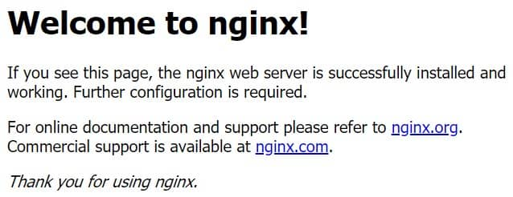

**Table of Contents**
- [1. How to Install Linux, Nginx, MySQL, PHP (LEMP Stack) on Ubuntu](#1-how-to-install-linux-nginx-mysql-php-lemp-stack-on-ubuntu)
  - [1.1. Install Nginx](#11-install-nginx)
    - [1.1.1. Start Nginx Service](#111-start-nginx-service)
    - [1.1.2. Allow Uncomplicated Firewall (ufw) to Nginx Connection](#112-allow-uncomplicated-firewall-ufw-to-nginx-connection)
  - [1.2. Install PHP for Nginx](#12-install-php-for-nginx)
    - [1.2.1. Start PHP-fpm Service](#121-start-php-fpm-service)
    - [1.2.2. Create a test.php File](#122-create-a-testphp-file)
  - [1.3. Install MySQL](#13-install-mysql)

# 1. How to Install Linux, Nginx, MySQL, PHP (LEMP Stack) on Ubuntu

## 1.1. Install Nginx

Run command below to update packages that need upgrading or just come to the repository
```
sudo apt-get update
sudo apt-get upgrade
```

Then add `nginx/stable` repository from PPA to apt list and install Nginx
```bash
sudo addp-apt-repository ppa:nginx/stable
sudo apt-get update

# can ignore above command, just run command below to install Nginx
sudo apt-get install -y nginx
```

> **Note:** PPA stands for Personal Package Archive. Use to get new package version that not available on official Ubuntu repositories. 

Successfully installed Nginx. Can check the Nginx version
```bash
nginx -v

# nginx version: nginx/1.18.0 (Ubuntu)
```

### 1.1.1. Start Nginx Service 

To start the Nginx service, run the below command
```bash
sudo service nginx start

# * Starting nginx nginx             [OK]
```

Open browser and type `localhost:80` or run command below in terminal to test your Nginx webserver
```
curl localhost:80
```

Welcome page will be show
```bash
# Welcome to nginx!
# If you see this page, the nginx web server is successfully installed and working. # Further configuration is required.
# 
# For online documentation and support please refer to nginx.org.
# Commercial support is available at nginx.com.
# 
# Thank you for using nginx.
```

Welcome page show in browser




### 1.1.2. Allow Uncomplicated Firewall (ufw) to Nginx Connection
If `ufw` firewall running, need to allow connections to Nginx

Type command below to enable
```
sudo ufw allow 'Nginx HTTP'
```

Verify the change
```
sudo ufw status
```

The command's output will show that HTTP traffic is allowed
```bash
# Status: active
# 
# To                         Action      From
# --                         ------      ----
# Nginx HTTP                 ALLOW       Anywhere
# Nginx HTTP (v6)            ALLOW       Anywhere (v6)
```

## 1.2. Install PHP for Nginx

After webserver is ready, now have to install and configure PHP. Here we install modules PHP-FPM and PHP-MySQL to use PHP with both Nignx and MySQL

Check the latest PHP version available to install
```
sudo apt-cache show php
```

Based on the available version `Version: 1:7.2+60ubuntu1`, install the following PHP modules
```
sudo apt-get install php7.2 php7.2-fpm php7.2-mysql\
php7.2-cli php7.2-curl php7.2-gd php7.2-mbstring
```

> **Note:** Core PHP packages will automaticallly be installed as dependencies

Check installed version
```bash
php -version

# PHP 7.2.24-0ubuntu0.18.04.7 (cli) (built: Oct  7 2020 15:24:25) ( NTS )
# Copyright (c) 1997-2018 The PHP Group
# Zend Engine v3.2.0, Copyright (c) 1998-2018 Zend Technologies
#     with Zend OPcache v7.2.24-0ubuntu0.18.04.7, Copyright (c) 1999-2018, by Zend Technologies
```

### 1.2.1. Start PHP-fpm Service

Run the command to start PHP-fpm service
```
sudo service php7.2-fpm start
```

> Need to configure PHP-fpm for Nginx, otherwise PHP would not be able to contact Nginx

Create or copy `default` server block configuration file whithin `/etc/nginx/sites-available` directory named `jh.com` (can name whatever)
```bash
# create new configuration
sudo nano /etc/nginx/sites-available/jh.com

# copy from default configuration
sudo cp /etc/nginx/sites-available/default /etc/nginx/sites-available/jh.com
```

Add or change the config to:
```bash
server {
        listen 80;
        root /var/www/html;
        # add index.php to the line below
        index index.php index.html index.htm index.nginx-debian.html;
        
        # change jh.com to your server name
        server_name jh.com;

        location / {
                try_files $uri $uri/ =404;
        }

        # enable pass PHP scripts to FastCGI server
        location ~ \.php$ {
                include snippets/fastcgi-php.conf;
                fastcgi_pass unix:/var/run/php/php7.2-fpm.sock;
        }

        location ~ /\.ht {
                deny all;
        }
}
```

Here's what each of these directives and location blocks do:
- `listen` - Defines what port Nginx will listen on. In this case, it will listen on port `80`, the default port for HTTP.
- `root` - Defines the document root where the files served by the website are stored.
- `index` - Configures Nginx to prioritize serving files named `index.php` when an index file is requested, if they're available.
- `sever_name` - Defines which serve block should be used for a given request to your server. **Point this directive to your server's domain name or public IP address.**
- `location /` - The first location block includes a `try_files` directive, which checks for the existence of files matching a URI request. If Nginx cannot find the appropriate file, it will return a 404 error.
- `location ~ \.php$` - This location block handles the actual PHP processing by pointing Nginx to the `fastcgi-php.conf` configuration file and the `php7.2-fpm.sock` file, which decalres what socket is associated with `php-fpm`.
- `location ~ /\.ht` - The last location block deals with `.htaccess` files, which Nginx does not process. By adding the `deny all` directive, if any `.htaccess` files happen to find their way into the document root they will not be served to visitors.

Next, enable new server block by creating a symbolic link from your new server block configuration file `/etc/nginx/sites-available/` to `/etc/nginx/sites-enabled`
```
sudo ln -s /etc/nginx/sites-available/jh.com /etc/nginx/sites-enabled/
```

Then, unlink the default configuration file from the `/sites-enabled` directory
```
sudo unlink /etc/nginx/sites-enabled/default
```

> **Note:** If need to restore the default configuration, can recreateing the symbolic link again
> ```
> sudo ln -s /etc/nginx/sites-available/default /etc/nginx/sites-enabled/
> ```  

Test new configuration file for syntax errors by typing:
```
sudo nginx -t
```
If any errors reported, recheck the configuration

Restart Nginx and PHP-FPM services
```
sudo service nginx reload
sudo service php7.4-fpm restart
```

### 1.2.2. Create a test.php File
Create an index.php file in `/var/www/html/`
```
sudo nano /var/www/html/info.php
```

Add the following lines and press `CTRL+X` and type `Y` then press `Enter` to save it
```
<?php
phpinfo();
```

> **Note:** The root directory to save your project, so that you can call it using Nginx in the browser, e.g `/var/www`

Now, can visit the page on browser by the `domain name` or `ip address`
```bash
# jh.com replace to your domain name
http://jh.com/info.php

# or 192.168.0.1 replace to your public or local ip address
http://192.168.0.1/info.php
```

The page show below, mean PHP set up with Nginx successfully


After verify Nginx generate page correctly, eemove the file by typing:
```
sudo rm /var/www/html/info.php
```

## 1.3. Install MySQL

use `apt` to install `mysql-server`
```
sudo apt install mysql-server
```

Recommended to run a security script that comes pre-installed with MySQL
```
sudo mysql_secure_installation
```

This will ask if you want to configure the `VALIDATE_PASSWORD_PLUGIN`

> **Note:** Enabling this features is something of a judgment. If enabled, passwords which don't match the specified criterial will be rejected by MySQL with an error. It is safe to leave validation disabled but you should always use strong, unique passwords for database credentials.

Run the command to start MySQL service
```
sudo service mysql start
```

After finised the security setting, try to log in MySQL
```bash
sudo mysql 

# login with password
sudo mysql -p
```

This will connect to the MySQL server as the administrative database user root. You should see output like below:
```
Welcome to the MySQL monitor.  Commands end with ; or \g.
Your MySQL connection id is 20
Server version: 8.0.23-0ubuntu0.20.04.1 (Ubuntu)

Copyright (c) 2000, 2021, Oracle and/or its affiliates.

Oracle is a registered trademark of Oracle Corporation and/or its
affiliates. Other names may be trademarks of their respective
owners.

Type 'help;' or '\h' for help. Type '\c' to clear the current input statement.
```

Exit MySQL console
```
mysql> exit 
```
